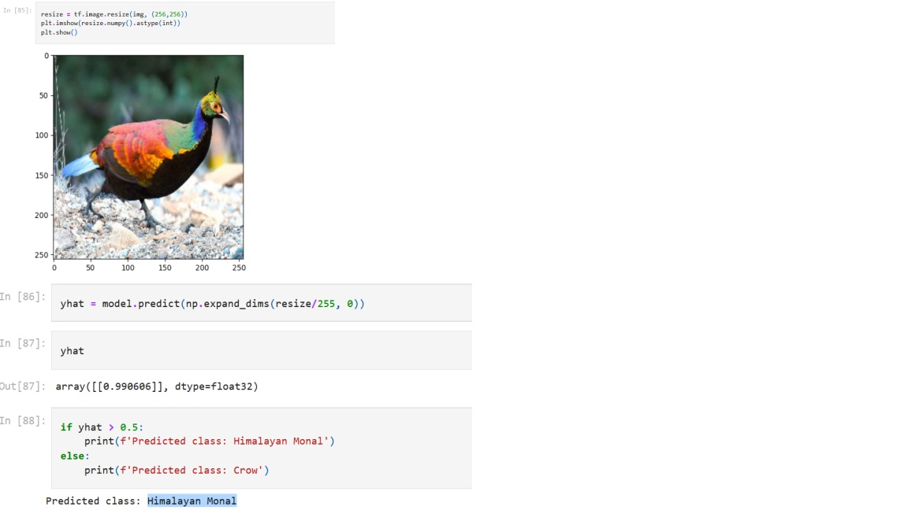

# Image-Classification-Using-CNN

This is an example of image classification done using a convolutional neural network. Note that this works only for binary image classification, and one needs to modify the code to make it work for the classification of multiple classes.

## Expected Output

- **Output**
  -

## NVIDIA GPU Driver Installation

1. Install the latest NVIDIA GPU driver for your device from [NVIDIA's official website](https://www.nvidia.com/Download/index.aspx).

## Version & OS Details

- **OS:** Windows 11
- **Graphics Card:** Nvidia GTX 1650 4GB vRAM
- **CUDA Version:** 11.8
  - 
  - Download Link: [CUDA 11.8](https://developer.nvidia.com/cuda-11-8-0-download-archive)
- **cuDNN Version:** 8.7
  - 
  - Download Link: [cuDNN Archive](https://developer.nvidia.com/rdp/cudnn-archive#a-collapse870-118)
- **TensorFlow Version:** 2.5
- **NumPy Version:** 1.19.5

## Resolve zlib.dll Error

To resolve the zlib.dll error, follow these steps:

1. Navigate to `C:\Program Files\NVIDIA Corporation\Nsight Systems 2022.4.2\host-windows-x64` and locate `zlib.dll`. Copy the file.

2. Go to `C:\Program Files\NVIDIA GPU Computing Toolkit\CUDA\v11.8\bin` and paste the copied file. Rename it from `zlib.dll` to `zlibwapi.dll`.

## Anaconda Environment Setup with TensorFlow

To set up an Anaconda environment with TensorFlow, follow these steps:

1. Create a new environment named 'tensorflow-gpu' with Python version 3.8:

    ```bash
    conda create --name tensorflow-gpu python=3.8
    ```

2. Activate the environment:

    ```bash
    conda activate tensorflow-gpu
    ```

3. Install TensorFlow version 2.5:

    ```bash
    pip install tensorflow==2.5
    ```

4. Enable notebook support in the environment:

    ```bash
    conda install -y -c conda-forge nb_conda
    ```

5. Add the environment to Jupyter Kernel:

    ```bash
    python -m ipykernel install --user --name tensorflow-gpu --display-name "Python 3.8 (tensorflow-gpu)"
    ```

After opening Jupyter Notebook, change the kernel from Python to Python 3.8 (tensorflow-gpu).
